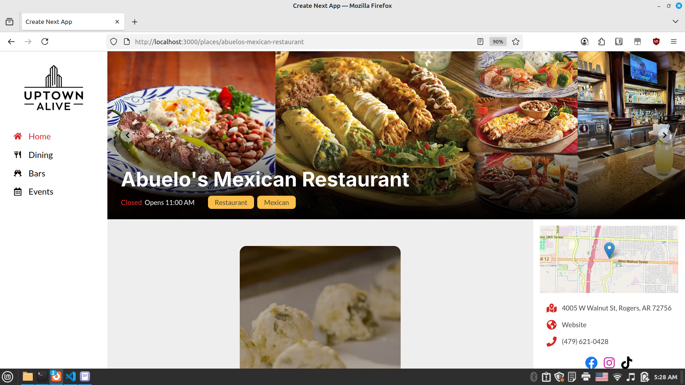
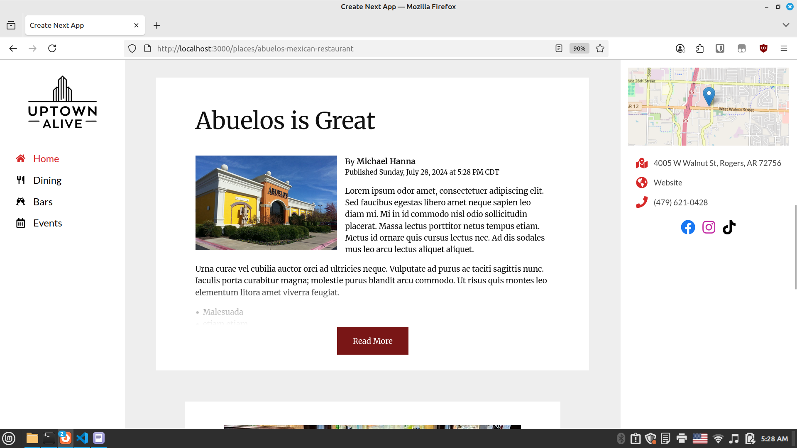
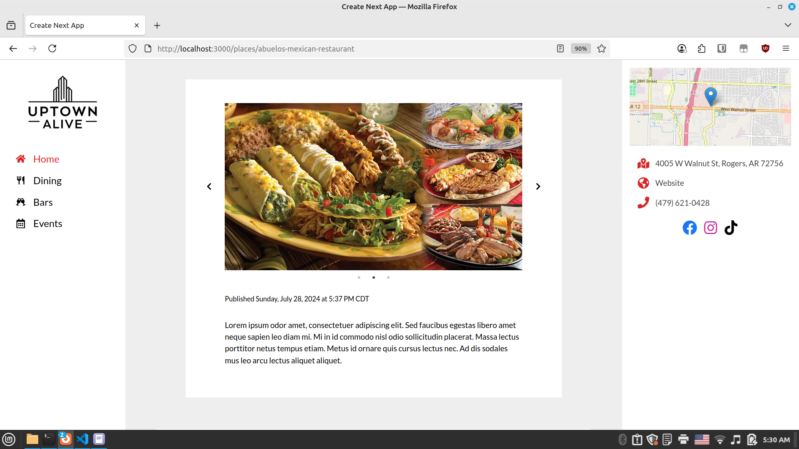
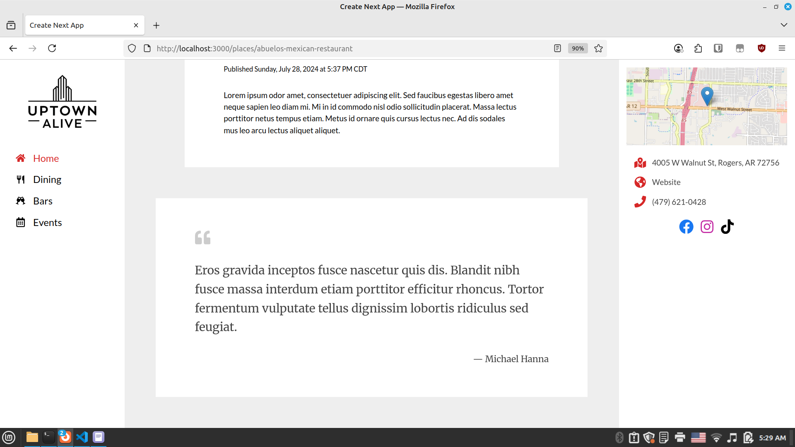

# Uptown Alive - Frontend

**Status:** 🛑 _Permanently shelved_  
**Stack:** Next.js · Tailwind CSS · TypeScript · Strapi (API)

Uptown Alive was a solo project aimed at building a local business directory and content platform that blended directory data with social-style media to drive discovery and engagement.

This repo contains the frontend, built with **Next.js** and **Tailwind CSS**, and designed to deliver a fast, responsive experience across devices. Features included:

- **Business landing pages** that surfaced directory and media content in a unified layout
- Smart **video playback logic** for auto-pausing inactive elements
- Responsive components for diverse post types: blog articles, video, galleries, and more
- Integrated with a custom Strapi backend (see [backend repo](https://github.com/mrhanna/uptown-alive-strapi) if available)

Development was guided by an evolving content strategy in collaboration with a media partner. The project was shelved in 2024 after a competing platform launched ahead of schedule.

> ⚠️ **Note to reviewers:** Some parts of the UI—particularly responsive behavior—are not fully polished. This prototype was built to demonstrate a proof of concept to the media partner: how content could be pushed to Strapi and reflected in real time on a business landing page. The focus was speed and flexibility, not refinement. Screenshots below reflect the state at the time the project was paused.

> While the project is no longer active, it reflects my ability to design and build a modern, performant frontend with thoughtful UX patterns and full CMS integration.

---

## Screenshots









---

This is a [Next.js](https://nextjs.org/) project bootstrapped with [`create-next-app`](https://github.com/vercel/next.js/tree/canary/packages/create-next-app).

## Getting Started

First, run the development server:

```bash
npm run dev
# or
yarn dev
# or
pnpm dev
# or
bun dev
```

Open [http://localhost:3000](http://localhost:3000) with your browser to see the result.

You can start editing the page by modifying `app/page.js`. The page auto-updates as you edit the file.

This project uses [`next/font`](https://nextjs.org/docs/basic-features/font-optimization) to automatically optimize and load Inter, a custom Google Font.

## Learn More

To learn more about Next.js, take a look at the following resources:

- [Next.js Documentation](https://nextjs.org/docs) - learn about Next.js features and API.
- [Learn Next.js](https://nextjs.org/learn) - an interactive Next.js tutorial.

You can check out [the Next.js GitHub repository](https://github.com/vercel/next.js/) - your feedback and contributions are welcome!

## Deploy on Vercel

The easiest way to deploy your Next.js app is to use the [Vercel Platform](https://vercel.com/new?utm_medium=default-template&filter=next.js&utm_source=create-next-app&utm_campaign=create-next-app-readme) from the creators of Next.js.

Check out our [Next.js deployment documentation](https://nextjs.org/docs/deployment) for more details.
